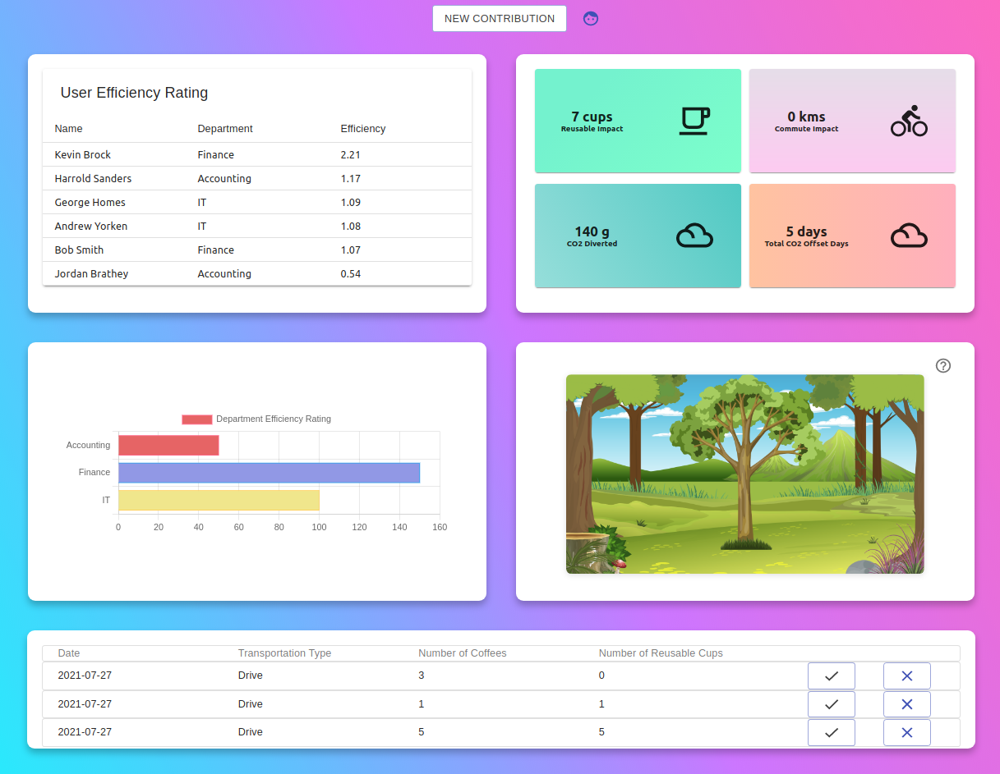
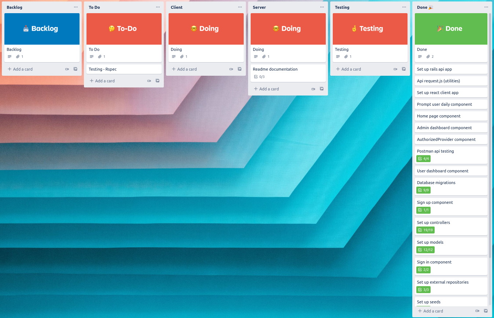

## Sustainable Workplace

## Jackie Sun and Ananda Rodziewicz

Deployed App: https://workplacesustainability.netlify.app/

Client Repo: https://github.com/FluroWhiteSnow/Sustainability-front-end

Server Repo: https://github.com/FluroWhiteSnow/Sustainable-app-server

Part A Documentation Repo: https://github.com/FluroWhiteSnow/Sustainable-app-documentation

Sustainable Workplace is an enterprise-based software to help large organizations reduce their carbon footprint and waste output. To do this, the web-based application tracks employees that participate in sustainable initiatives such as opting to reduce their carbon footprint by walking to the office or reducing their waste output by adopting the use of a reusable cup. The application has been built with a Ruby on Rails backend and a React frontend. The client application is deployed on Netlify and the server-side is deployed on Heroku.

 

## User Instructions

---

To view the production application, please visit www.app.com and create an account or use an existing account. A test account is provided below, in the installations instructions below.

### Installation instructions for local testing

To use the app locally please follow the instructions below.

Requirements:

- Node.js
- RubyOnRails
- Ruby 2.7.2

**Server:**

- create a directory on your machine and `$ cd` into it
- While in that directory, from bash CLI / terminal, clone the server repo `$ git clone https://github.com/FluroWhiteSnow/Sustainable-app-server`
- cd into the server folder
- Install all required packages `bundle install`
- Now we need to create a local database and seed the data
- In terminal run `rails db:create`
- then run `rails db:seed`
- then `rails db:migrate`
- Now we can start the server `rails s`
- The server will run on port 3000

**Client:**

- From the terminal clone the frontEnd repository `git clone https://github.com/FluroWhiteSnow/Sustainability-front-end`
- CD into that folder
- Install all packages by running `npm install` or `yarn install`
- The server shall run on PORT=8080
- The browser window will now open

To log in with a pre-made account user the following credentials
(or sign up!)

- Username: Bob1
- Email: bob@gmail.com
- Password: test123

 

## Purpose

The purpose of this application is to create a sustainable ecosystem for businesses, where employees are empowered and accountable to make environmentally conscious decisions. The application aims to help individuals and corporations overcome the challenges of adopting long-lasting sustainable change.

Businesses and their employees are conscious of their carbon footprint. Many of us want to live a more sustainable and green lifestyle however, sometimes we forget how much of an impact small over-sites impact the environment. A lot of us try actively to attempt to be more sustainable at home however when it comes to work we sometimes tend to forget. With our web application, we are able to visually show you your personal impact and sustainability efficiency over a period of time.

 

## Functionality / Features

The application consists of an employee dashboard page and an admin dashboard page, alongside a settings pop-up page. The application will prompt employees to input information during or at the end of a work shift.

All Users: The application will require all users to enter a username and password to be authenticated to access the application.

**All Users**: When authorized, users will have access to their dashboard containing information on their sustainability efforts.

- Create Account
- Display dashboard for information relevant to the account
- Create, delete and update daily sustainability figures
- Automatically update graphs upon user input
- Edit account information

 

## Target Audience

The target audience will be individuals aged between 20 - 44 in corporate workplaces who are aware of sustainability issues. To do this, the application will offer digital incentives in the form of an interactive dashboard. The objective is to turn the users' newly adopted behavior of bringing reusable cups and opting out of driving to work to become an everyday habit. Once employees begin to adopt this habit, they will be encouraged to become more environmentally conscious over time as they begin to see the cumulative impact of their change in behavior as well as the impact of the wider workforce.

 

## Testing

Our application has been tested on both Chrome and Firefox on macOS and Ubuntu.

Throughout the development of our application, we extensively implemented manual testing through Postman, and manual through the browser.

We also implemented RSpec to do some testing in our back-end. RSpec allowed us to ensure data was saving properly and authentication was working so we didn't have to manually do API calls each time we wanted to test something.

Manual test logs:
https://docs.google.com/spreadsheets/d/1d0BGxodv-XP1qhKCM5TxL8K2DEd5sahUKia1JsZ26F0/edit?usp=sharing

 

## Libraries and Dependencies

### Serverside dependencies and libraries

- Ruby on Rails: We used Ruby on Rails as a measure to communicate with our PostgreSQL database.
  Using Ruby on Rails we were able to create a back-end server we could make API requests.

- PostgreSQL: is a relational database, we used PostgreSQL to store all our data into specific tables based on information that we want to access

- Knock: Knock is an authentication solution for a Rails API application based on JSON Web Tokens
  knock allows to be able to easily authenticate users and allows us to be able to provide user authorization.

- Bcrypt: is a ruby gem that enables us to encrypt and decrypt user passwords. Bcrypt uses a sophisticated hashing algorithm and provides a simple wrapper for safely handling passwords.

- RSpec: is a testing framework for ruby. It allowed us to write automated tests for how our data moved and saved in the back end of this application.

- CORS: cors is a node.js package that enables CORS origin resource sharing. Using CORS enabled us to share and access resources between our Ruby on Rails server and our React client

### Clientside dependencies and libraries

- React: Is a Javascript Front-end library for building user interfaces or UI components.
  The client-side of this application was build using the React library.

- react-dom - is a complimentary library with react. React-dom allows us to bind react to the DOM. Doing so enables us to be able to use such methods as `render()` which allows us to display various components in the browser.

- material UI core, icons, lab: Material UI is a library that allows us to access and import different components to create an interactive user interface in our application. Material UI uses Material Design principles developed by Google.

- chart.js: is a library that provides us with components that we can use for charting. This library was used to develop the horizontal bar chart component you see in the dashboard.

- JSONpretty: is a code formater. We used to display JSON data in a neat format which enabled us to read return API calls easier.

 

## DataFlow Diagram

 

## Application Architecture Diagram

 

## Wireframes and screenshots

### wireframe for login screen

 
 

### Production log in screen

### Wireframe for user Dashboard

### Production dashboard

 

 

 

### What we would have done differently and reasons for pivoting from our initial wireframes

As we have 7 tables in our database, and a lot of our databases are automatically populated with data depending on other tables' data. To get this working, and working in an efficient manner was not easy. We most likely would have made the back end a lot simpler by reducing our table count and prompting the user for more questions, rather than doing calculations storing data that way.

We pivoted from our initial wireframe dashboard design to a simpler one dashboard design that displays all user data and current user data. Doing so allowed us to focus more on the components we wanted to implement. We also realized that with the time restraints we had, having more charts as we did in our wireframes was not feasible.

We feel that what we have in our production app displays the data we want to show.

 

## Project management

Trello board link: https://trello.com/b/xR8n1vRM/full-stack-part-b

We used 2 different Trello boards for the first and second part of our application.
We used Trello so we could delegate parts of our application that needed to be done and who needed to do it. We set time dates we wanted to get certain features and components done by. However, running into a lot of issues not a lot of these deadlines were met.

>
>
>
>
>

 

## User Persona

---

   

Photo Credit: Ben den Engelsen via Unsplash

### Bio 🤳

Name: Sarah Holmes (she/her)

Role: Marketing Intern @ Canva

Education: Bachelor of Arts in Communication

Status: Single

Location: Sydney, Australia

Sarah is a marketing intern for Canva, a graphic design platform used to design a wide range of products from posters to social media graphics and other visual content. This intern position is Sarah's first exposure to the industry. Sarah is a part of the digital marketing team and can leverage her past freelancing experience. Her first project is to develop an email campaign targeted towards existing customers to renew their Canva subscription. Being in the marketing team, Sarah realizes the amount of paper waste that occurs through her daily activities.

### Goals 🧱

- Improve workplace sustainability by recycling and reducing the number of printed documents
- Planting more trees and supporting the conservation of plants in state and national parks

### Pain points 📌

- Getting everyone on the same page on reducing the amount of paper waste
- New to the team, Sarah feels a sense of disconnect when she leads conversations on sustainable workplace culture

 
 

---

   

Photo Credit: Ben Parker via Unsplash

### Bio 🤳

Name: Norman Parke (he / him)

Role: Senior Software Engineer @ Xero

Age: 32

Education: Bachelor of Computer Science

Status: Single

Location: Melbourne, Australia

Norman is a senior software engineer at Xero, a cloud-based accounting platform designed for small to medium enterprises. As the senior software engineer, Norman leads a team of five members. His agile team is in charge of the payments platform, where users input their payment details. In his free time, Norman enjoys going hiking and swimming at the beach.

### Goals 🧱

- Play his part in cleaning up the ocean to preserve marine biology
- Increase awareness on plastic waste and its effects on sea turtles

### Pain points 📌

- Finding plastic wash up on shore at the beach
- Colleagues and friends purchasing a coffee with a plastic cup
- The lack of policies implemented by the Australian government to tackle the waste problem

 
 

---

   

Photo Credit: Derick Daily via Unsplash

### Bio 🤳

Name: Harry Thurman (he/him)

Role: Product Lead for Anchor @ Spotify

Age: 46

Education: Nurse

Status: Married

Location: Perth, Australia

Harry Thurman is a Nurse at the Royal Perth Hospital. He works in the emergency room tending to patients that have unexpected physical injuries. Harry has been working in the healthcare industry for over five years and has built a natural empathy towards patients that arrive. In his free time, Harry enjoys going to his hobby farm and tending to his animals. He is a massive animal lover and tries to spend all his free time with them.

### Goals 🧱

- Reduce his carbon footprint by driving less and cycling to the hospital
- Reduce the amount of time spent riding dirt bikes on his property and purchase an electric-powered bike

### Pain points 📌

- Driving to work when its raining and watching fumes come out of cars and trucks
- Having to drive to work because of the lack of storage space in his backpack

 
 

---

   

Photo Credit: Ana Itonishvili via Unsplash

### Bio 🤳

Name: Melinda Barry (she/her)

Role: People and Culture Manager @ KPMG

Age: 34

Education: Bachelor of Business, Human Resources

Status: Single

Location: Melbourne, Australia

Melinda is the People and Culture Manager at KPMG, one of the four largest accounting firms globally. She is leading a wide range of campaigns to reduce plastic usage in the workplace. Her key priorities are to reduce the number of plastic cups that are being thrown into the corporate bins and also the amount of plastic bags that are appearing on her colleague's desks. Melinda has been conducting qualitative interviews in the workplace to discover insights that can help her campaigns be more impactful.

### Goals 🧱

- Reduce the number of plastic cups that are going into the corporate bins. The bins are weighed at the end of every day
- Gain more quantitative data on the impact of her campaigns
- Increase employee engagement in her campaigns

### Pain points 📌

- Gaining little insight on qualitative impacts of her campaigns
- Lack of oversight for all employees that are participating in her campaigns. Melinda is only able to interview a few participants which only provides a small sample size on the impact of her campaigns
- Integrating sustainability into the culture of KPMG

 
 

## User Stories

| User Story                                                                                                                                                                                                                                  | Related Persona |
| :------------------------------------------------------------------------------------------------------------------------------------------------------------------------------------------------------------------------------------------ | :-------------: |
| As Sarah, a junior public relation assistant at Ernest and Young, I want to find other sustainable employees that are looking to reduce their waste output in the workplace, so I can find like-minded individuals that share common goals. |    Persona 1    |
| As Sarah, a UX designer intern at Telstra, I want to log the design team's efforts in reducing coffee cup waste, so that we can convince other colleagues to purchase KeepCups.                                                             |    Persona 1    |
| As Sarah, an associate front-end developer at MYOB, I want to be incentivized to be more sustainable at the workplace, so that I can have the motivation I need to be more mindful to be sustainable.                                       |    Persona 1    |
| As Norman, a senior civil engineer at Lendlease, I want to reduce my plastic waste at the workplace, so that I can motivate my colleagues to do the same by showing them my waste reduction.                                                |    Persona 2    |
| As Norman, an investment analyst at AustralianSuper, I want insight into the company's efforts in creating a sustainable workplace, so that I can feel proud of the organization I am working for.                                          |    Persona 2    |
| As Norman, a solutions architect at Amazon, I want to see how many coffee cups I save in a year by using a reusable cup, so that I can play a part in clearing up the ocean from plastic waste.                                             |    Persona 2    |
| As Harry, a doctor at South Perth Hospital, I want to reduce my carbon footprint in a way that benefits me physically, so that I can find an excuse to ride my bike to work and feel good about it.                                         |    Persona 3    |
| As Harry, a credit analyst at Commonwealth Bank, I want to see the CO2 impact of me walking to work so that I can quantify my efforts to prevent global warming.                                                                            |    Persona 3    |
| As Harry, a senior account executive at a boutique design agency, I want to track my own sustainability efforts in the workplace, so that I can quantify my efforts and look for areas of improvement.                                      |    Persona 3    |
| As Melinda, a human resource manager at Bupa, I want to track the number of employees that are using reusable cups every month, so that I can see the results of my kick the cup campaign.                                                  |    Persona 4    |
| As Melinda, a people and culture manager at Carsales, I want to quantify the carbon emissions offset from our sustainability campaigns, so that I can highlight the effectiveness of our sustainability campaigns.                          |    Persona 4    |
| As Melinda, the chief operating officer at Zendesk, I want to track the total emissions saved from employees opting out of driving to work, so that I can create a culture of sustainability and health, and wellbeing.                     |    Persona 4    |

 
 
 
